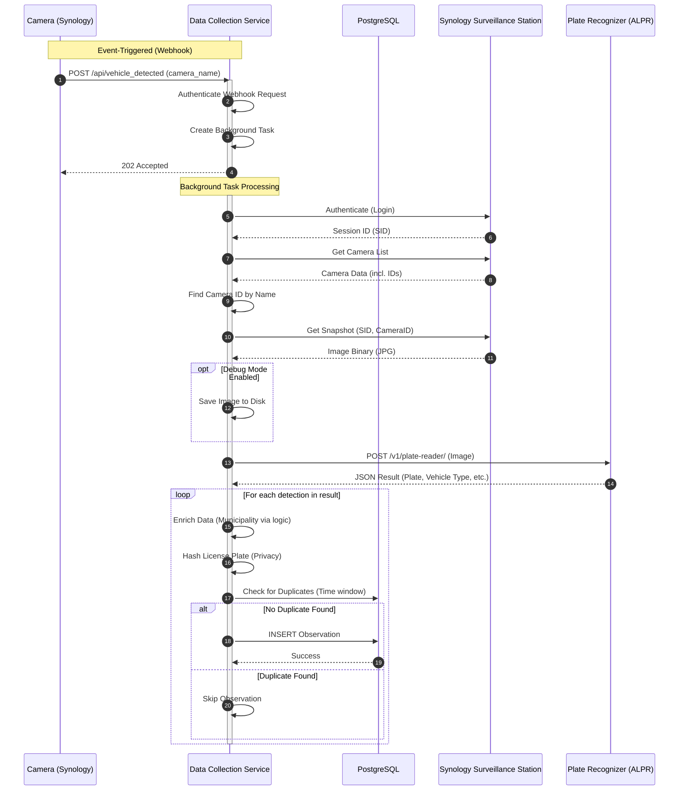

# Data Collection Flow

This diagram illustrates the data collection process in the system.

```mermaid
sequenceDiagram
    autonumber
    participant C as Camera (Synology)
    participant DCS as Data Collection Service
    participant DB as PostgreSQL
    participant SS as Synology Surveillance Station
    participant PR as Plate Recognizer (ALPR)

    Note over C, DCS: Event-Triggered (Webhook)

    C->>DCS: POST /api/vehicle_detected (camera_name)
    activate DCS
    DCS->>DCS: Authenticate Webhook Request
    DCS->>DCS: Create Background Task
    DCS-->>C: 202 Accepted
    deactivate DCS

    Note over DCS: Background Task Processing

    activate DCS
    DCS->>SS: Authenticate (Login)
    SS-->>DCS: Session ID (SID)
    
    DCS->>SS: Get Camera List
    SS-->>DCS: Camera Data (incl. IDs)
    
    DCS->>DCS: Find Camera ID by Name
    
    DCS->>SS: Get Snapshot (SID, CameraID)
    SS-->>DCS: Image Binary (JPG)
    
    opt Debug Mode Enabled
        DCS->>DCS: Save Image to Disk
    end
    
    DCS->>PR: POST /v1/plate-reader/ (Image)
    PR-->>DCS: JSON Result (Plate, Vehicle Type, etc.)
    
    loop For each detection in result
        DCS->>DCS: Enrich Data (Municipality via logic)
        DCS->>DCS: Hash License Plate (Privacy)
        
        DCS->>DB: Check for Duplicates (Time window)
        alt No Duplicate Found
            DCS->>DB: INSERT Observation
            DB-->>DCS: Success
        else Duplicate Found
            DCS->>DCS: Skip Observation
        end
    end
    deactivate DCS
```